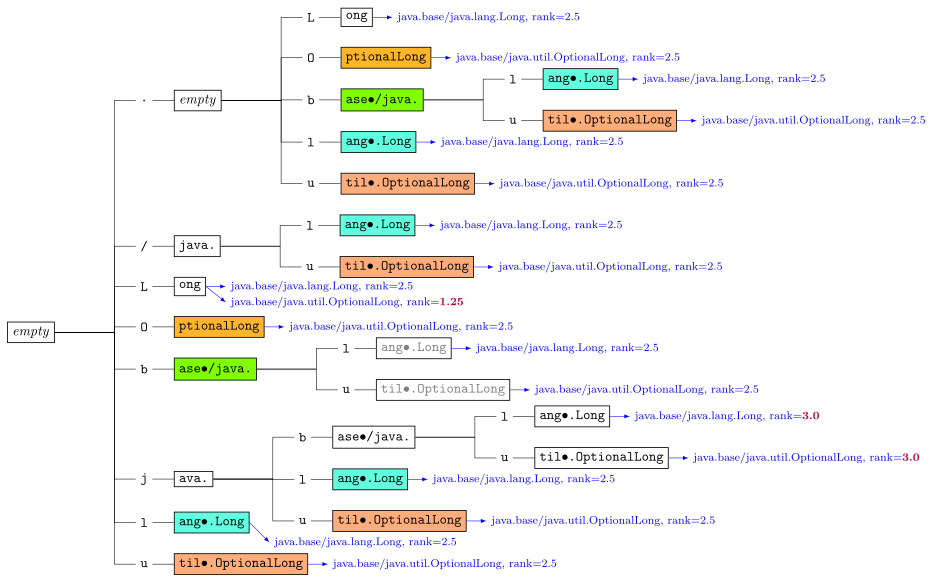

:encoding: utf-8
:lang: en
:title: Javadoc Search
:description: Fast Server-side Search Engine for Javadoc API
:keywords: search, java, api, search-engine, maven, regular-expression, trie, javadoc, search-algorithm, qute, quarkus
:author: Christian Femers
:showtitle:
:icons: font

= Javadoc Search

A fast server-side search engine for the JDK 18 Javadoc API.

*Available at https://javadoc-search.maisikoleni.net*

Can also be added to a bowser as custom search engine:

- Search URL Template: +
  `https://javadoc-search.maisikoleni.net/api/search/redirect?query=%s`
- Search Suggestions URL Template: +
  `https://javadoc-search.maisikoleni.net/api/search/suggestions?query=%s`

[WARNING]
====
The above is a fairly weak server and not suitable for benchmarking.
====

== Details

Realized as https://quarkus.io[Quarkus] web application mainly with https://quarkus.io/guides/qute[Qute],
https://quarkus.io/guides/resteasy[RESTEasy] and https://microstream.one/platforms/microstream-for-java/[Microstream].
The client-side uses https://getbootstrap.com[Bootstrap] and https://htmx.org[htmx].

The search engine is implemented as a https://en.wikipedia.org/wiki/Radix_tree[sparse radix trie]
generated from the `xxx-search-index.js` files of a Javadoc site.
It is also mixed with a https://en.wikipedia.org/wiki/Suffix_tree[suffix tree]
for name segments of the Javadoc elements.

The following example shows the trie generated for `java.lang.Long`
and `java.util.OptionalLong`, both in the `java.base` module.
The trie will be compressed such that the equally colored nodes point to the same object.

.Example trie

To search in that trie like one can in the official Javadoc implementation,
the nodes in the trie are being traversed recursively
based on a custom regular expression matcher implementation.

This allows for the following search syntax:

- Query `*ja.l.o*` will find:
   * `java.base/java.lang.Object`
   * `java.base/java.lang.Override`
   * `java.base/java.lang.OutOfMemoryError`
- Query `*LDT*` will find:
   * `java.base/java.time.LocalDateTime`
   * `java.base/java.time.chrono.ChronoLocalDateTime`
   * ...
- Query `*math max*` will find:
   * `java.base/java.lang.Math.max(double, double)`
   * `java.base/java.lang.Math.max(long, long)`
   * ...
- Query `*j.u.s.Col.jo*` will find:
   * `java.base/java.util.stream.Collectors.joining()`
   * `java.base/java.util.stream.Collectors.joining(CharSequence, CharSequence, CharSequence)`
   * `java.base/java.util.stream.Collectors.joining(CharSequence)`
- Query `*.C~rs*` will find:
   * `java.base/java.util.stream.Collectors`
   * ...

The search engine implementation is _mostly_ compliant with the
https://docs.oracle.com/en/java/javase/18/docs/specs/javadoc/javadoc-search-spec.html[Javadoc Search Specification]
but also includes major changes that will be introduced in JDK 19
(and therefore, I also felt free to include custom behavior).

[NOTE]
====
One example for that is `~`, which allows skipping lower case characters
until the following part of the search term matches.
Like the custom regular expression implementation, `~` is possessive
and the engine will not backtrack to find a match.
====

As a result of the trie and simplified regex matching combination,
the search is very fast and rarely exceeds 20 ms.
Most of the time, search completes in about 1 ms.
The longer the search term, the faster the results are available.

The matching results are currently ranked by:

- Where the match of the query starts. +
  A match starting at the beginning is the best case, a match starting
  at or after a separator comes next and matches that start
  within identifiers (upper-case letters, underscore) have the lowest rank.
  `java.desktop/javax.print.attribute.SetOfIntegerSyntax`
  is therefore a better match for `*Set*`
  than `java.base/java.util.AbstractSet`.
- How good they match the query. +
  `java.base/java.io.File.isHidden()` is a better match for `*File.isH*`
  than `java.base/java.nio.file.Files.isHidden(Path)` because
  it does not require further lower case characters after `File`.
- Natural order of the entries. +
  Results with smaller char values at the same position come first.
  The implementation is very much like `String.compareTo`
  on the last segment of the qualified name.

Case insensitive matching is only performed
if case-sensitive did not yield _any_ results.

== Building

This project requires at least JDK 17.

Building should be straightforward since this is a regular Maven project.

- `mvn clean` to clean up generated artifacts (does not remove the `database` folder)
- `mvn test` runs all tests
- `mvn quarkus:dev` starts the
  https://quarkus.io/guides/dev-mode-differences[Quarkus dev mode] (live reload)
- `mvn package` bundles the web application using the `prod` profile
  into `target/quarkus-app`

It might be helpful to add the missing search-index files
in `src/main/resources/net/maisikoleni/javadoc/service/jdk18`
(see `jdk-index-files-go-here.txt` there for details), but this is not required
as they are then fetched from the official site and cached in `database/javadoc-indexes`.

To run outside Maven, `--add-exports java.base/jdk.internal.misc=ALL-UNNAMED` is required
as MicroStream requires Unsafe at the moment.
